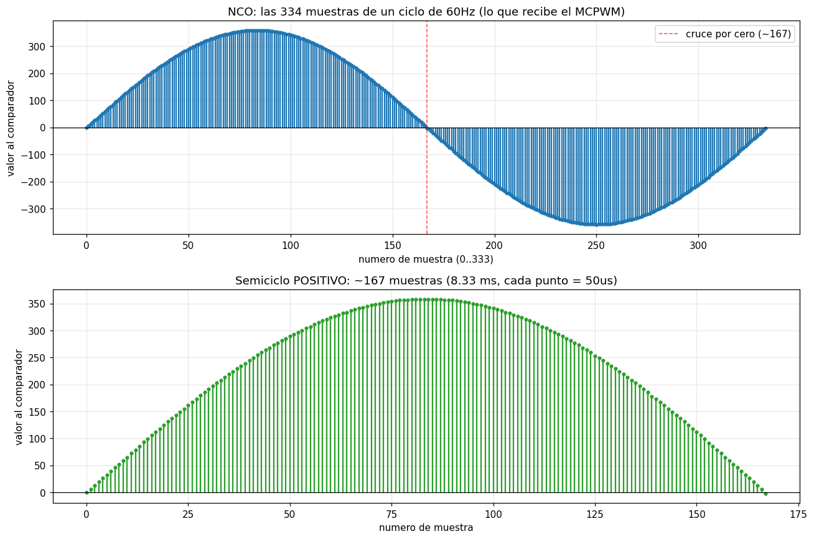
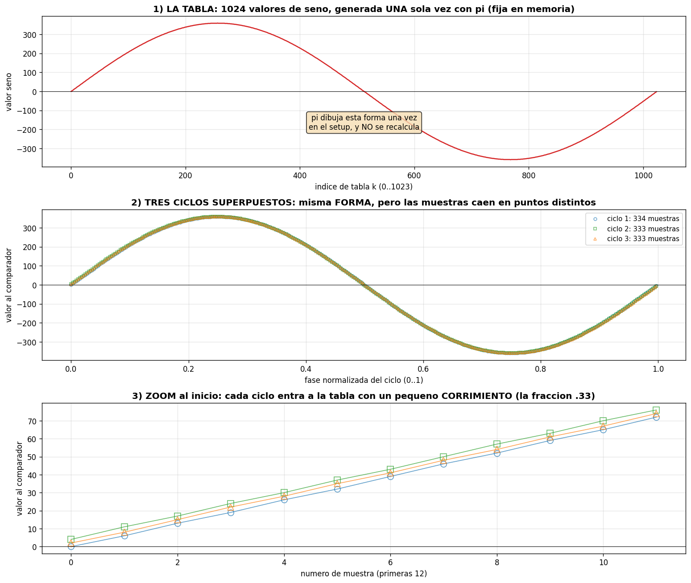
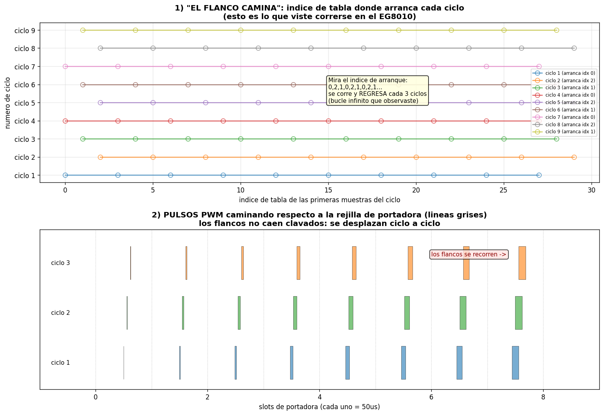
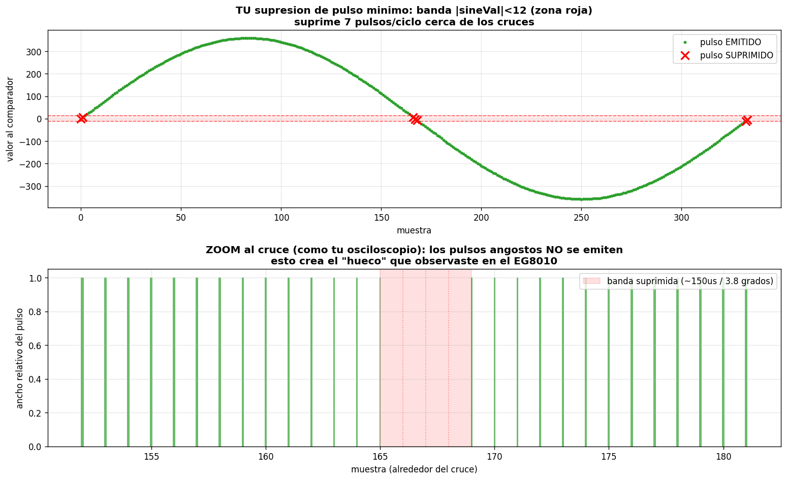

# ACOMULADOR_FASE_NCO_EVIDENCIA
Un estudio de cómo el inversor genera su onda senoidal, con las tablas, gráficas y mediciones derivadas directamente del código real (no de teoría general). Está escrito para que cualquiera con curiosidad y paciencia —no solo un ingeniero— pueda seguir, entender y verificar cómo nace la onda.

# Estudio Técnico de la Onda: Acumulador de Fase (NCO) y Generación SPWM

### Evidencia del código — Inversor SPWM ESP32 — para que el 99% observe cómo funciona

> **Qué es este documento.** Un estudio de cómo el inversor genera su onda senoidal,
> con las tablas, gráficas y mediciones derivadas **directamente del código real**
> (no de teoría general). Está escrito para que cualquiera con curiosidad y paciencia
> —no solo un ingeniero— pueda seguir, entender y verificar cómo nace la onda. Cada
> número aquí sale de simular la misma lógica que corre en el ESP32.
>
> **Alcance honesto.** Esto es evidencia de la **lógica** del NCO (la generación
> numérica de la onda), validada por simulación de los parámetros reales del código.
> NO sustituye la validación de POTENCIA en banco (corriente real, calor, carga),
> que es una fase aparte con sus propios instrumentos. La lógica es correcta y
> reproducible; la física se mide en hardware.

---

## 1. La idea en una frase

El inversor genera su onda senoidal con un **acumulador de fase** (NCO, *Numerically
Controlled Oscillator*): una "manecilla" numérica que gira sumando un valor fijo,
y en cada paso lee el valor del seno de una tabla. Es un oscilador hecho de pura
aritmética de enteros — sin componentes analógicos, sin recalcular senos en vivo.

Analogía: un reloj de una manecilla. Una vuelta completa = un ciclo de la onda. Si
la manecilla da 60 vueltas por segundo, genera 60 Hz.

---

## 2. Los parámetros reales del código

Todos verificados en `inversor_acumulador_fase_LCD.ino`:

| Parámetro | Valor | Qué significa |
|-----------|-------|---------------|
| ACC_BITS | 32 bits | tamaño del acumulador (la manecilla) |
| TABLE_SIZE | 1024 | puntos de la tabla de seno (el círculo dibujado) |
| ACC_SHIFT | 22 | cuántos bits se descartan para indexar la tabla |
| phase_increment | 12,884,902 | cuánto avanza la manecilla por paso (la frecuencia) |
| portadora real | 20,000.00 Hz | cuántas veces por segundo se genera una muestra |
| fundamental | 60.0000 Hz | la frecuencia senoidal objetivo |
| muestras por ciclo | 333.33 | cuántas muestras forman un ciclo de 60 Hz |
| amplitude | 359 | el pico de la tabla de seno |

**Resultado de exactitud:** con estos valores, la frecuencia generada es
**60.000001 Hz** — exactitud de milihertz. Más abajo se explica por qué.

---

## 3. Cómo funciona, paso a paso (lo que pasa en cada muestra)

En la interrupción que corre 20,000 veces por segundo, el NCO hace solo tres cosas,
todas aritmética de enteros (rápida):

```c
phase_acc += phase_increment;          // 1. avanza la manecilla
uint32_t idx = phase_acc >> ACC_SHIFT; // 2. mira en que parte del circulo esta
int sineVal = sine_table[idx];         // 3. lee el valor del seno ahi
```

No hay cálculo de seno en vivo, no hay números decimales en el camino crítico. El
seno se calculó **una sola vez** al arranque (con π), y la interrupción solo **lee**
lo ya calculado. Por eso es tan ligera y no interfiere con el resto del sistema.

---

## 4. La tabla de seno: el círculo dibujado una vez

La tabla de 1024 valores se llena una sola vez en el arranque, usando π:

```c
for (int k = 0; k < TABLE_SIZE; k++) {
  float ang = 2.0f * PI * k / TABLE_SIZE;   // angulo de 0 a 2pi (un ciclo)
  sine_table[k] = amplitude * sinf(ang);    // valor del seno en ese angulo
}
```

π se usa aquí, **una vez**, para dibujar la forma de un ciclo completo. Después no
se vuelve a usar: el NCO solo recorre esta forma ya grabada.

**Figura 1** muestra esta tabla — la forma de referencia, fija en memoria.



*Arriba: las 334 muestras de un ciclo, los datos que el NCO entrega al MCPWM.
Abajo: el semiciclo positivo solo, ~167 muestras, cada una de 50 µs.*

---

## 5. Cuántos datos genera el NCO (las cuentas)

Derivado de los parámetros reales:

| Medida | Cantidad | Cómo sale |
|--------|----------|-----------|
| Datos por segundo | 20,000 | la ISR corre a la portadora de 20 kHz |
| Por ciclo completo (16.67 ms) | 333.33 | 20,000 ÷ 60 |
| Por semiciclo positivo (8.33 ms) | 166.67 | la mitad de un ciclo |
| Duración de cada muestra | 50 µs | 1 ÷ 20,000 |

Esas ~167 muestras por semiciclo son la **resolución de la onda**: cada lomo de la
senoidal se dibuja con unos 167 puntos. Por eso sale suave, no escalonada.

---

## 6. Tabla de muestras — hitos de un ciclo (datos reales)

Estos son los puntos clave de las 334 muestras de un ciclo (la tabla completa de las
334 está en el archivo `nco_ciclo_muestras.csv`):

| Muestra | phase_acc | índice tabla | valor al comparador | qué es |
|---------|-----------|--------------|---------------------|--------|
| 0 | 0 | 0 | 0 | arranca el ciclo |
| 1 | 12,884,902 | 3 | +6 | empieza a subir |
| 7 | 90,194,314 | 21 | +46 | subiendo |
| 83 | 1,069,446,866 | 254 | +358 | pico positivo |
| 166 | 2,138,893,732 | 509 | +6 | casi en cero |
| 167 | 2,151,778,634 | 513 | −2 | cruce a negativo |
| 250 | 3,221,225,500 | 768 | −359 | pico negativo |
| 333 | 4,290,672,366 | 1022 | −4 | cierra el ciclo |

Nota: el índice de tabla avanza ~3 por muestra (0, 3, 6, 9...), porque
1024 ÷ 334 ≈ 3.07. La manecilla salta unas 3 posiciones de la tabla en cada paso.

---

## 7. Por qué la frecuencia es exacta: la magia de los 32 bits

Aquí está lo más elegante del diseño, y se puede ver con datos.

Las 333.33 muestras por ciclo **no son un número entero**. ¿Cómo se mantiene
entonces 60.0000 Hz exactos? Porque el acumulador de 32 bits guarda la fracción.

Se usan solo los **10 bits de arriba** para indexar la tabla (1024 = 2¹⁰). Los **22
bits de abajo** guardan la fracción sobrante, que no se pierde — se arrastra al
siguiente paso. Es como llevar el "0.33 que sobra" en la cuenta para no perderlo.

**Evidencia medida (simulando 3 ciclos del código real):**

| Ciclo | Muestras | Índice de arranque |
|-------|----------|--------------------|
| 1 | 334 | 0 |
| 2 | 333 | 2 |
| 3 | 333 | 1 |
| **Suma 3 ciclos** | **1000** | (vuelve a 0 en el ciclo 4) |

Tres ciclos suman **exactamente 1000 muestras**. Promedio: 333.33 muestras/ciclo,
que da **60.0000 Hz exactos**. El patrón se cierra cada 3 ciclos porque
0.33 × 3 = 1.0 — la fracción completa una unidad entera y todo se reinicia.

**Figura 2** demuestra esto: tres ciclos superpuestos caen sobre la misma forma,
pero las muestras entran en puntos ligeramente distintos cada vuelta.



*Panel 1: la tabla fija. Panel 2: tres ciclos superpuestos — misma forma, muestras
en puntos distintos. Panel 3: zoom al arranque, el corrimiento de la fracción .33.*

---

## 8. El "caminar" de los flancos — verificado contra hardware real

Como las muestras por ciclo no son enteras, los flancos del PWM **se desplazan**
ciclo a ciclo y el patrón se cierra cada 3 ciclos (0, 2, 1, y vuelta a 0). Este
fenómeno fue **observado en vivo en un osciloscopio** sobre un chip comercial
(EG8010), y coincide con lo que predice la teoría del NCO.

**Figura 3** reproduce ese caminar de flancos con los números del código.



*El índice de arranque de cada ciclo: 0, 2, 1, 0, 2, 1... se corre y regresa cada 3
ciclos. Esto es lo que se ve "caminar" en el osciloscopio. No es defecto: es la firma
de generar 60 Hz exactos desde una portadora que no es múltiplo entero de 60.*

Esta es una pieza de validación importante: un fenómeno **observado primero en el
banco**, luego **explicado por la teoría del propio código**. Observación → modelo →
coincidencia. El método completo, sobre hardware real.

---

## 9. Supresión de pulso mínimo cerca del cruce

Cerca del cruce por cero, el valor del seno tiende a cero, así que los pulsos PWM se
vuelven muy angostos. Un pulso demasiado corto **no se puede ejecutar físicamente**
(el MOSFET no alcanza a conmutar, el driver no responde) y produciría basura. La
solución: cuando el pulso cae bajo un mínimo ejecutable, **no se genera**.

En el código:

```c
#define MIN_PULSE_NS    (2.0f * DEADTIME_NS * 1.2f)   // = 720 ns
bool suppress = (sineVal > -MIN_PULSE_TICKS && sineVal < MIN_PULSE_TICKS);
```

**Datos reales de la supresión:**

| Medida | Valor |
|--------|-------|
| Dead-time | 300 ns |
| Umbral mínimo de pulso | 720 ns (2 × dead-time × 1.2) |
| MIN_PULSE_TICKS | 12 |
| Pulsos suprimidos por ciclo | 7 (de 334) |
| Ancho de la pausa por cruce | ~150 µs |
| Banda en grados de fase | ±1.92° alrededor de cada cruce |
| Porcentaje del ciclo | ~1% por cruce |

El umbral está **atado al dead-time** (no es arbitrario): un pulso debe ser más
ancho que el dead-time para producir conducción real, por eso el mínimo es
proporcional al dead-time, con 20% de margen.

**Figura 4** muestra qué pulsos se suprimen (las X rojas, justo en los cruces).



*Arriba: la banda de supresión (zona roja) atrapa los pulsos demasiado angostos en
los cruces. Abajo: zoom al cruce, los pulsos angostos no se emiten — esto crea el
"hueco" que también se observa en chips comerciales.*

---

## 10. Qué demuestra este estudio

1. **La frecuencia es exacta (60.000 Hz)** y la exactitud viene de un mecanismo
   concreto y verificable: el arrastre de la fracción en el acumulador de 32 bits.
   No es casualidad ni aproximación — es aritmética demostrable.

2. **La onda es suave**: ~167 muestras por semiciclo dan una senoidal bien formada.

3. **El "caminar" de flancos es normal y esperado** — se observó en hardware real y
   se explica por la teoría del propio código. No es un defecto.

4. **La supresión de pulso mínimo protege la conmutación** cerca del cruce, con una
   banda estrecha (±1.92°) atada a la física del dead-time.

5. **Todo es reproducible**: cualquiera puede simular estos mismos números con los
   parámetros del código y obtener los mismos resultados. Esa es la diferencia entre
   afirmar y demostrar.

---

## 11. Lo que este estudio NO cubre (honestidad de alcance)

- **No es validación de potencia.** Estas son evidencias de la LÓGICA del NCO. El
  comportamiento real bajo corriente, calor y carga se mide en banco, con sonda de
  corriente y análisis de THD, no por simulación.
- **No mide la onda física de salida.** Mide cómo el NCO genera los datos; cómo esos
  datos se vuelven una onda real depende de la etapa de potencia, el filtro y la
  carga, que se validan aparte.
- **Los números de exactitud son del modelo del código.** El cristal real del ESP32
  tiene su propia tolerancia; la frecuencia física se mide con frecuencímetro.

---

## 12. Archivos de evidencia (reproducibles)

- `nco_ciclo_grafico.png` — las muestras de un ciclo y el semiciclo positivo.
- `nco_ciclos_superpuestos_evidencia.png` — tres ciclos, la forma y el corrimiento.
- `nco_flancos_caminando_eg8010.png` — el caminar de flancos (patrón cada 3 ciclos).
- `comparacion_supresion_pulso_minimo.png` — la banda de supresión cerca del cruce.
- `nco_ciclo_muestras.csv` — las 334 muestras completas (muestra, acumulador,
  índice, valor) para contrastar contra mediciones de banco.
- `nco_parametros.csv` — la tabla de parámetros del NCO.

---

*Estudio técnico para evaluación y difusión abierta. Guía para la transición
energética. Hecho para que el 99% no solo use el inversor, sino que entienda y
verifique cómo nace su onda — porque el conocimiento que se puede comprobar es el
único que de verdad libera. Medir antes de creer; y aquí, además, mostrar la
evidencia para que cualquiera la compruebe.*
